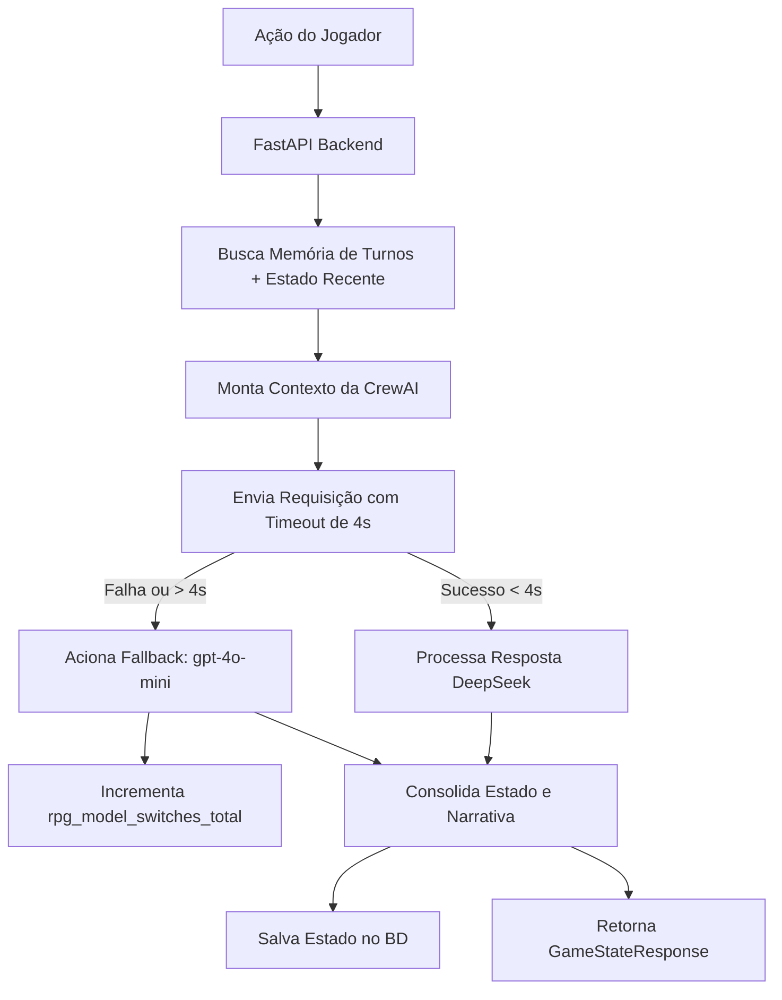

# Arquitetura da Crew (CrewAI & Integração DeepSeek)

Este documento define a especificação arquitetural da equipe de agentes do orquestrador **CrewAI**, incluindo seus papéis, objetivos, histórias de fundo (backstories), tarefas sequenciais de turno e como o contexto e a API do **DeepSeek** são injetados na execução do jogo.

---

## 1. Configuração da LLM (DeepSeek & Fallback)

O CrewAI utiliza o LiteLLM internamente para interfacear com diversas APIs de inteligência artificial. O backend FastAPI configurará duas instâncias de LLM (Langchain/CrewAI LLM classes):

### LLM Primária (DeepSeek)
* **Modelo**: `deepseek/deepseek-chat` (referência ao modelo `deepseek-v3` ou `deepseek-coder` via API oficial)
* **Configuração de Conexão**:
  * `api_key`: Fornecida via variável de ambiente `DEEPSEEK_API_KEY`.
  * `base_url`: `https://api.deepseek.com`
  * `temperature`: `0.7` (equilíbrio ideal entre consistência mecânica e criatividade narrativa).
  * `max_tokens`: `1500`
  * `timeout`: `4.0` segundos (limite rígido controlado pelo middleware ou cliente HTTP da LLM).

### LLM Reserva (Fallback / Contingência)
* **Modelo**: `openai/gpt-4o-mini` (ou outro modelo rápido e econômico)
* **Configuração de Conexão**:
  * `api_key`: Fornecida via variável de ambiente `OPENAI_API_KEY`.
  * `temperature`: `0.7`
  * `timeout`: `8.0` segundos.

---

## 2. Agentes da Crew (Roles, Goals & Backstories)

A Crew de agentes é composta por dois agentes principais que colaboram de maneira sequencial e coordenada para resolver cada turno do jogador.

### A. Agente Mestre (Game Master - GM)
* **Role**: `Diretor de Jogo e Narrador Principal`
* **Goal**: `Arbitrar as ações do jogador de forma imparcial de acordo com as regras de RPG clássicas, descrever as consequências físicas no mundo e atualizar o estado de vida e inventário do jogador.`
* **Backstory**:
  > Você é um narrador lendário de RPG de mesa (Game Master), reconhecido por descrições imersivas, atmosfera de suspense e imparcialidade estrita. Suas histórias são ricas em detalhes sensoriais e respondem com lógica de causa e efeito física a cada ação do jogador.
  > Você gerencia o estado oculto das masmorras, armadilhas e inimigos. Quando o jogador toma uma ação, você deve determinar se ele obteve sucesso ou falhou (simulando testes de atributos por baixo dos panos) e calcular quaisquer consequências físicas diretas, como dano sofrido, poções consumidas ou novos itens adquiridos. Você se comunica estritamente através do cálculo de mecânicas e descrição de fatos.
* **LLM Ativa**: Vinculada à LLM Primária (DeepSeek) com chave de fallback ativo.

### B. Agente NPC (World Companion)
* **Role**: `Companheiro de Viagem e Habitante Local`
* **Goal**: `Reagir emocionalmente e dialogicamente aos eventos do turno e escolhas do jogador, adicionando profundidade dramática, diálogos elore regional à narrativa final.`
* **Backstory**:
  > Você é Eldon, um guia e arqueólogo local que acompanha o jogador na exploração da masmorra antiga. Você possui um temperamento cauteloso, medo de criaturas das trevas e um vasto conhecimento sobre a história e símbolos das ruínas.
  > Suas falas e reações são espontâneas e devem refletir o que acabou de acontecer no turno. Você nunca decide o resultado das ações físicas do jogador (isso é dever do Mestre), mas você reage verbalmente e pode oferecer conselhos, expressar pavor ou comemorar sucessos ao lado do jogador, mantendo uma personalidade rica e coerente.
* **LLM Ativa**: Vinculada à LLM Primária (DeepSeek) com chave de fallback ativo.

---

## 3. Tarefas Sequenciais do Turno (Tasks)

O loop de jogo executa um processo sequencial de três tarefas a cada ação submetida pelo jogador.

### Tarefa 1: Resolução de Ação e Mecânica (Arbitragem)
* **Agente Responsável**: Agente Mestre
* **Entradas (Contexto Injetado)**:
  * Histórico de Turnos Recentes (Últimos 3 turnos para consistência temporal).
  * Estado Atual do Jogador (Vida atual, Inventário, Localização).
  * Ação do Jogador (Input bruto recebido da API).
* **Descrição da Tarefa**:
  > Analise a ação do jogador: "{player_action}". Com base no estado atual do jogador (Vida: {health}, Inventário: {inventory}) e na lore do ambiente, determine o resultado da ação.
  > Se a ação envolver perigo ou combate, calcule o sucesso e as consequências físicas.
  > Se o jogador for atingido, calcule o dano (um número inteiro). Se ele usar um item de cura do inventário, remova-o do inventário e determine a cura.
  > Retorne uma descrição factual das consequências no ambiente física e o resumo das alterações de estado (vida perdida/ganha, itens adicionados/removidos).
* **Estrutura de Saída**: Pydantic Schema (`ActionResolutionModel` contendo a narrativa física, variação de vida e modificações de itens).

### Tarefa 2: Reação do Companheiro (Diálogo)
* **Agente Responsável**: Agente NPC
* **Entradas (Contexto Injetado)**:
  * Saída da Tarefa 1 (Resolução de Ação e Mecânica).
* **Descrição da Tarefa**:
  > Leia o resultado físico determinado pelo Mestre na Tarefa anterior. Como Eldon (seu personagem), reaja de forma falada e corporal a esses acontecimentos.
  > Se o jogador sofreu muito dano, expresse preocupação ou medo. Se o jogador encontrou um item histórico, compartilhe um detalhe rápido da lore.
  > Mantenha a reação curta, expressiva e em primeira pessoa.
* **Estrutura de Saída**: Texto plano contendo o diálogo/reação do NPC.

### Tarefa 3: Consolidação e Formatação da Narrativa
* **Agente Responsável**: Agente Mestre
* **Entradas (Contexto Injetado)**:
  * Saída da Tarefa 1 (Resolução física).
  * Saída da Tarefa 2 (Reação de Eldon).
* **Descrição da Tarefa**:
  > Combine de forma fluida a narrativa física da Tarefa 1 com o diálogo/reação do NPC da Tarefa 2.
  > Crie um texto literário coeso, imersivo e sem repetições que será exibido na tela do jogador.
  > Além da narrativa literária consolidada, calcule o estado final absoluto do jogador: Nova Vida (garantindo limites entre 0 e 100) e Novo Inventário atualizado.
* **Estrutura de Saída (JSON Final)**: O orquestrador deve estruturar a resposta para bater exatamente com a especificação da API (`GameStateResponse`):
  ```json
  {
    "narrative": "Texto narrativo final unificado...",
    "player_state": {
      "health": 85,
      "max_health": 100,
      "inventory": ["Espada", "Escudo"],
      "alive": true
    }
  }
  ```

---

## 4. Injeção de Contexto e Memória de Curto Prazo

Para garantir que a API do DeepSeek não sofra com alucinações de estado ou perca o fio da história, o Backend FastAPI gerenciará uma **Memória de Turno** persistida em banco de dados ou em cache Redis:



* **Estrutura de Memória**: O prompt do sistema (System Message) e o histórico de até 3 mensagens anteriores de turno serão concatenados como `Context` nas tarefas do CrewAI.
* **Consistência de Estado**: O estado do jogador (vida, inventário) é o contrato mestre. Se a LLM alucinar que o jogador ganhou um item que não foi processado fisicamente na Tarefa 1, a lógica do backend FastAPI atua como validadora ("guardrail") antes de persistir e responder ao Frontend.
